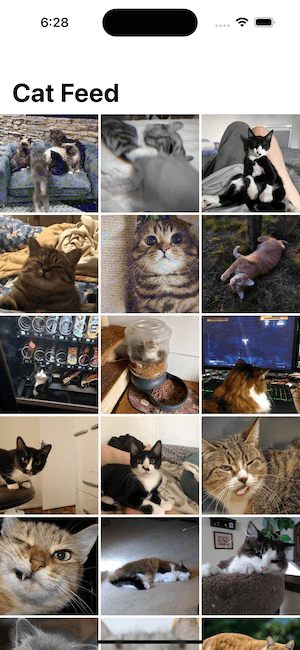

# Cat Gallery

[![Swift Version][swift-image]][swift-url]

This is a SwiftUI app that uses the [CATAAS API](https://cataas.com/) to show cats

## 📋 Features

- [x] Endless Cat Feed
- [x] Pagination
- [x] Image Caching

## 📸 Screenshots

  

## ☝️ Requirements

- iOS 14.0+
- Xcode 12.0+

## 🌎 Localization

This app is localized for English and Spanish. App strings are stored in `CatGallery/Strings`, then converted to type-safe variables by [SwiftGen](https://github.com/SwiftGen/SwiftGen) at build time. 

These variables are saved to `CatGallery/Generated/Strings+Generated.swift`. **Don't modify this file** as it is overwritten every time the app builds. A convenience struct called `Strings.swift` is provided to access localized strings. 

## ℹ️ CATAAS Limitations 

The CATAAS API provides an endpoint for pagination, but it doesn't work as expected. When setting `skip > 0` as a query parameter in `/api/cats`, the API returns more results than specified in the `limit` field. As a result, the second page of results is much larger than the first in this app.

## 🤝 Dependencies

### [Alamofire](https://github.com/Alamofire/Alamofire)

Used for networking.

### [SwiftGen](https://github.com/SwiftGen/SwiftGen)

Used to generate type safe images, fonts, colors, and localized strings at build time.

### [Nuke](https://github.com/kean/Nuke)

Used for optimized image loading and caching.

[swift-image]:https://img.shields.io/badge/swift-5.0-orange.svg
[swift-url]: https://swift.org/
